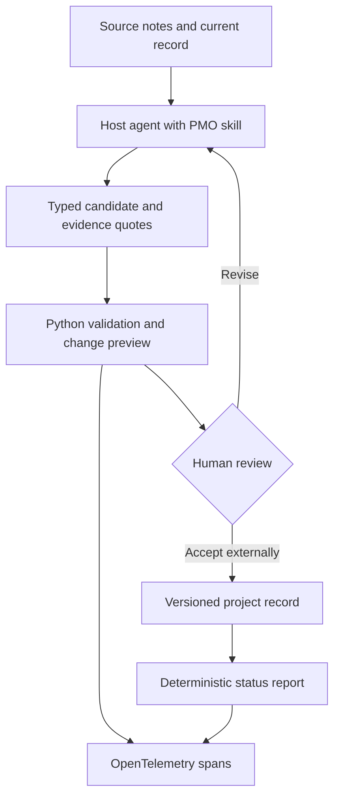

# PMO Skills

**Evidence-linked RAID changes and status reports that expose contradictions.**

Two portable Agent Skills plus a typed Python validation engine. Turn project notes into reviewable RAID proposals, then generate status reports from the same records. Built by Faisal A with AI assistance; examples are synthetic.

**v0.1 scope:** RAID maintenance and status reporting. Risk records are supported inside RAID; a dedicated risk workshop skill and stage-gate skill are future work.

## Architecture & data flow



The host agent performs interpretation. Python verifies structure, literal evidence references and explicit policy rules. Human reviewers decide whether evidence actually supports the claims. The CLI never calls a model, changes source files or records an approval.

## Core features & key technical decisions

- **Two connected skills:** `pmo-raid` proposes changes; `pmo-status` reports exceptions from the same schema.
- **Evidence-linked records:** unknown sources and quotes absent from source text are rejected. Missing owners/dates remain unknown and generate findings.
- **Visible contradictions:** an open milestone blocker produces RED even if the reported status is GREEN. Incomplete evidence coverage yields UNKNOWN unless a critical exception is already known.
- **Reviewable changes:** base fingerprint, exact revision increment, preserved item IDs, immutable historical source entries and explicit closure evidence. Nothing is auto-applied.
- **Deterministic output:** stable rules and Markdown rendering; no invented executive narrative or computed LLM confidence.
- **Minimal telemetry:** opt-in OpenTelemetry JSONL spans with operation names, counts and status. Source text, quotes, IDs and exception contents are excluded. Explicit local tracing samples every operation and ignores environment resource attributes.

## Evals & benchmarks

See the [paired model-probe guide](docs/BENCHMARK.md), [evaluation methodology](docs/EVALUATION.md) and the committed [offline results](evals/results.json). The result file is produced by the evaluation command below.

| Measure | v0.1 treatment |
| --- | --- |
| Rule correctness | 16/16 development fixtures pass exact status and finding-set checks |
| Regression suite | 75 tests pass, including bad types, fabricated references, unsafe revisions and paired-run scoring |
| Model extraction accuracy | Not benchmarked; requires real host-agent runs |
| Model latency / cost per query | Not measured; the offline CLI performs no model calls |
| CLI latency | Measured by the offline harness; machine-specific, not an LLM benchmark |
| Time saved | Not measured; no productivity claim |

The optional paired probe adds ten public synthetic cases, randomized baseline/skill runs, explicit request and spend controls, and blinded semantic-review packets. No live model comparison has been run.

Run `python evals/run.py` to emit fresh JSON results to stdout. Use `python evals/score_runs.py PATH.jsonl` to score paired baseline/skill model outputs collected through your host. No API credentials are needed for the offline suite.

## Tech stack justifications

| Component | Reason |
| --- | --- |
| Agent Skills open format | Portable domain instructions and progressive loading |
| Python 3.11+ / Pydantic 2 | Shared typed contracts and JSON Schema for structured outputs |
| Standard-library CLI and renderer | Small offline runtime, deterministic reports, no external service requirement |
| OpenTelemetry SDK | Inspectable spans without coupling to a hosted vendor |
| pytest, Ruff, mypy, GitHub Actions | Behavioral checks, formatting, strict typing and repeatable CI |

There is no database or async orchestration in this local release: it has no remote I/O or persistent execution service. The host owns model concurrency, rate limits and permissions. Adding an API server would not improve this release's workflow.

## Getting started

### Local

```bash
python -m venv .venv
source .venv/bin/activate
python -m pip install -e '.[dev]'
pmo validate examples/project.json
pmo review examples/project.json
pmo report examples/project.json
pmo preview examples/project.json examples/proposal.json
mkdir -p local-results
pmo --trace local-results/review-trace.jsonl review examples/project.json
pytest -q
python evals/run.py
```

On Windows, activate with `.venv\Scripts\activate`. Trace files must be new: existing paths are never overwritten. Commands write reports to stdout and errors to stderr. Exit 0 means the command completed, **not** that project health is GREEN; invalid inputs exit 2. Input files are capped at 5 MB.

### Docker

```bash
docker build -t pmo-skills:0.1 .
docker run --rm pmo-skills:0.1 report examples/project.json
```

For your own data, mount a directory read-only at `/data` and pass `/data/project.json`. Container build verification is reported in [EVALUATION.md](docs/EVALUATION.md).

### Use the skills

Keep this repository checked out, install the Python package in the host's environment, and use your agent client's documented project-skill discovery or explicit file-loading mechanism. The source directories are `skills/pmo-raid` and `skills/pmo-status`.

For an immediate manual trial, ask the host to read `skills/pmo-status/SKILL.md` and process `examples/project.json`. Each skill references its local contract guide. Clients differ in discovery, approval and script execution; no universal installer or cross-client compatibility is claimed.

The synthetic demo deliberately reports GREEN while an unresolved interface blocker affects a milestone. The resulting [status report](examples/status-report.md) surfaces RED and the contradiction.

## Project structure

| Path | Responsibility |
| --- | --- |
| `skills/` | Two Agent Skills and concise contract references |
| `src/pmo_skills/models.py` | Project, evidence, RAID and assessment contracts |
| `src/pmo_skills/review.py` | Explicit screening policies |
| `src/pmo_skills/changes.py` | Revision checks and change preview |
| `src/pmo_skills/report.py` | Escaped Markdown rendering |
| `src/pmo_skills/telemetry.py` | Opt-in safe spans |
| `tests/` | Behavioral and CLI tests |
| `evals/` | Labeled fixtures, offline evaluator and paired-run scorer |
| `examples/` | Synthetic input, proposal, report and trace |
| `docs/` | Architecture, evaluation protocol and trust boundaries |

## Known limitations & future improvements

- Literal quote matching cannot establish semantic support or source authenticity. Humans must review dates, scoring, classifications and closures.
- The sample red/amber/green rules are configurable heuristics, not PMI standards or a certification. RAID means risks, assumptions, issues and dependencies in this pack.
- Completeness is a supplied assertion. Empty-but-confirmed records can screen GREEN; that does not prove an absence of risk.
- Prompts and metadata do not enforce authorization. Model hosts must isolate tools and enforce permissions independently.
- Exact normalized-title matching catches only simple duplicates. Semantic merging is left to human review.
- Change previews are read-only; there is no authenticated approval service, concurrent write coordinator, ERP integration or deployment claim.
- Stage-gate review, spreadsheet export, cross-client evaluation and measured baseline-versus-skill model results are next candidates.

## References

- [Agent Skills specification](https://agentskills.io/specification)
- [Pydantic models](https://docs.pydantic.dev/latest/concepts/models/)
- [OpenTelemetry Python instrumentation](https://opentelemetry.io/docs/languages/python/instrumentation/)

Questions or reproducible defects: open a repository issue with synthetic inputs. Never submit employer data, credentials or confidential project records.
